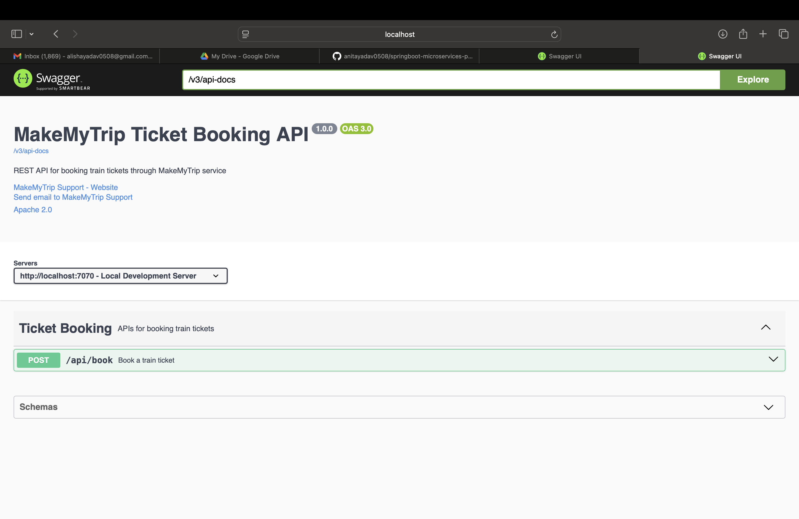

# http://localhost:7070/swagger-ui.html (what different type of api we built)
# ---------------------------------I want to implement REST CLIENT for IRCTC Application------------------------------------------------------------------------------
# Here we have 2 application one is MakeMyTrip and second one  is IRCTC application and MMT application communicate with IRCTC application

# image1.png :- we need to design this diagram application, where IRCTC act as resources or producer(who will provide api) . while MakeMyTrip act as client or consumer(who will consume api)

# TO design MakeMyTrip Rest Client we need some information IRCTC application.
# 1):- Resource service URL
# 2) Request Method Type
# 3) Request/Response Api Structure(Input/output data structure)
# 4) API Produces/consumes Format

# how IRCTC will provide above information either in Swagger url or api documentation.

# Assumes IRCTC is developed by someone else and we are developing only MakeMyTrip application, Earlier we play a role for application developer now we play role of client developer, so in real time either one party play role of application develper or other party will
# play role of client developer and so on.

# Here  do we need to write logic to book ticket to IRCTC website or to invoke IRCTC api to book ticket 

# -------rt.postForEntity(endPointUrl,request,TicketResponse.class) we are telling the resttemplate this is the url of api where you send request and this is the data that you have to send along to the request(i.e PassengerRequest data) and you give me the reponse in this object format i.e TickeReponse.class object format.
# --- explanation of this statement or line --------------------
# endpointUrl parameter(1st)(Know as Resource URL) = TO which url you want to send the post request */
# request parameter(2nd):- what data you want to send to the request body and  what is the request here ans is PassengerRequest or our restclient send passenger request to IRCTC api only when restTemplate using messageConvertor and message convertor using jackson api to convert object to json at client side.
# TicketResponse(3rd parameter):-how we want to hold response at client side.
# What api will do, it will process the request and send ticket data in json ,  Do you think this request object will goes to api Ans is No, restTemplate convert our request object to json format data and send to api then what api will do ? It will process the request and send the response as json again 
# what i am telling to restTemplate, hey RestTemplate you take the json,convert json to TicketResponse class object and give to to me. Here java request object convert to json when sending the request once receive the response to json then converted back to java.Here serialization/Deserialization happen at same method.
# convert request object to json(serialization), convert json to TicketResponse class object(deserialization).
# here client is running 7070 port while server/restapi is running on 9090 port

# --------------- HOW TO RUN THIS APPLICATION------------------------------------------------------
# http://localhost:7070/swagger-ui.html
# 
# Request Payload
 {
    "name": "Anita Yadav",
    "dob": "1992-08-05",
    "gender": "Female",
     "doj": "2025-01-15",
    "from": "Mumbai",
    "to": "Delhi",
    "train": "Rajdhani Express"
}

# ------------------------------ How conversion happened internally between resource api and REST-CLIENT - refer how_internally_conversion_happen_between_resourcer_and_client.png this image-------------------------------------------------- 
 
# When user send a request to MakeMyTrip application using swagger, it send json data now this json data pass to RestController(namee TicketBookingRestController),which expect java object as paramert i.e (Passenger Request as input parameter), which use message convertor to convert json -> obj  and gives object data to service now service having code how to call 3rd party api(in our case how to call IRCTC application api) so it pass java object to RestTemplate, which is predefined class to send request to resource api using postForEntity method to send post request here 
# which uses MessageConverter and MessageConvertor use Jackson api  which convert object to json  and send json data as http request data on request of post method type to call IRCTC application api.Now IRCTC application having rest controller named (IRCTCController),which expect java as object parameter(i.e PassengerRequest class object), which convert json data to java object using message convertor which uses jackson api now IRCTC application return response of passenger request data by converting java object to json to RestClient application i.e MakeMyTripApplication Now on client side we have RestTemplate which perform conversion to convert json data to java object and pass to Service now Service return response data to Rest controller of Client application and RestController convert java object to json and send,TicketResponse as json to End User which expect data as json who do request from swagger.
# Qus:- why we do conversion at so many places?Ans- Interoperability
                    
# who play role of resource or client ?
# Ans:- UI play role of client and MakeMyTrip is Resource for UI, WHILE MakeMyTrip is act as Client For IRCTC application while IRCTC is resource for MakeMyTrip application.

# can we use restTemplate below way  instead of private RestTemplate rt = new RestTemplate() ? Ans: No
@Autowired
private RestTemplate rt 

# because it works on builder design pattern 

 #  ------------To do @ Autowired we have to do following steps:- --------------------------

@Configuration
public class RestTemplateConfig {
@Bean
  public RestTemplate createRestTemplate(){

        RestTemplate rt = new RestTemplate();
                return rt;
  }
  }

# why we create RestTemplateConfig class because we have to use RestTemplate at multiple places so every time to create RestTemplate object like RestTemplate rt = new RestTemplate(), to avoid this we use RestTemplate as configuration, how will it work?
# So IOC will call this method i.e createRestTemplate() at the time of application start and this RestTemplate object is represented as spring bean and whenever you do @Autowired it will inject RestTemplate object. if i don't use this step of code  
RestTemplate rt = new RestTemplate(); return rt; will i am able to use @Autowired private RestTemplate rt Ans is No.
# why we using Builder design pattern ?:- when we send a request to server we need some handler to handle request,we need some messageConverter for converting raw data to respective , some authorization value so on so they give chance to programmer to set these parameter
               

# How to inform IOC to call this method? Ans:-  by using annotation @Bean, only then you can do @Autowired otherwise you can't do it directly because IOC container is not going to create object of RestTemplate.IOC will give the chance to the programmer to create object of the RestTemplate, because whenever you create RestTemplate object you have  the chance to set some other properties to RestTemplate object base on your requirement.like what function you can callled refer this image why_Programmer _create_RestTemplateObjecct.png

# How to inform IOC to call this method? Ans:-  by using annotation @Bean
# only then you can do @Autowired otherwise you can't do it directly 
# if you have multiple place where you want to use RestTemplate then you crate a RestConfig which initiate the RestTemplate. To represent java class as configuration class we use annotation
# @Configuration.

# suppose i want to call IRCTC application api from my MakeMyTrip application in that api is access only by token we have to pass token with url. So pass access-token,Content-Type,Accept we have to use HttpHeaders like
HttpHeaders headers = new HttpHeaders();
headers.set("Content-Type","application/json")
headers.set("Accept","application/json")
# How To send header to httRequest ?
# Ans:- By using HttpEntity class,
# HttpEntity<PassengerRequest> request = new HttpEntity<>(bodyData,headers)

# ------------- we can use exchange method of RestTemplate class which can use any type of httprequest(like GET,PUT,POST,DELETE)
# ResponseEntity<TicketResponse> response =   rt.exchange(endPointUrl, HttpMethod.POST,request,TicketResponse.class);
    // OR

#  ResponseEntity<TicketResponse> response =rt.postForEntity(endPointUrl,request,TicketResponse.class);
     
     

