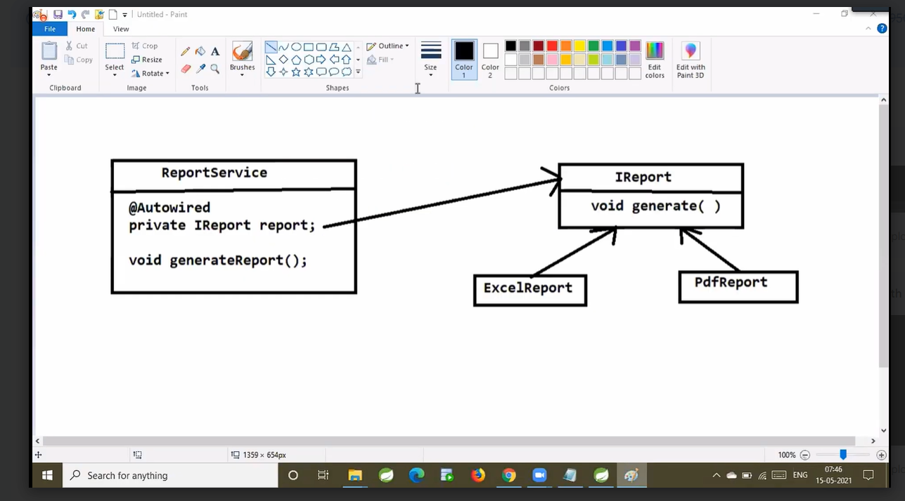

# To know about dependent bean their are two way
# 1. By Type 2. By Name

#    ----- By Type---------------------
# if we have only one dependent bean knows by type(like Userdao is one dependent bean)
# like 
# private UserDao userdao
# public UserService(UserDao userdao){ this.userdao = userdao}

#  -------------By Name----------------------
#  like i have interface IReport which implement by 2 dependent bean (Pdf and Excel)
# so it known by name like on @Qualifier("pdf"),@Qualifier("excel"),
 

