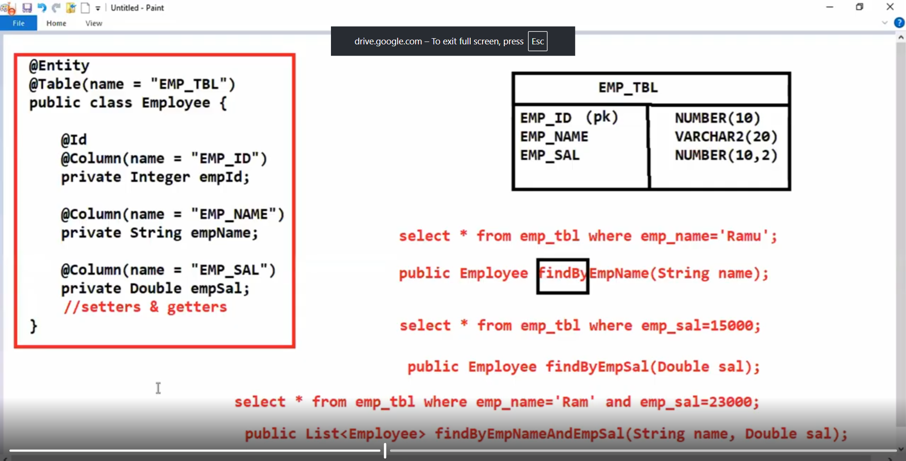

# To perform find Query except primary key then we use JPA for DB
# Queries

# 1) By using predefined methods
# 2) We can generate queries using findBy methods
# 3) we can work with custome queries also in spring data jpa
# using @Query() annotation

# if you want to fetch record of a specific column from table i.e
# projection is possible only from @Query method its not possible by
# findBy method

