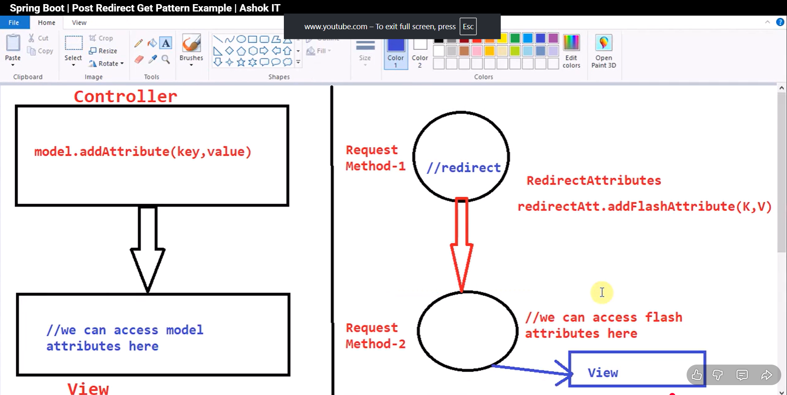

#

# when you want to  transfer data from controller to view then we use Model attribute
# But when we pass data from one request to another request then model attribute is not sufficient
# need to use RedirectAttributes

# RedirectAttributes
# :- to transfer the request parameter from one request to another request.

@PostMapping("/createUser")
/*This method is used to handle user Acc creation Form*/
public String createUserAcc(RedirectAttributes attributes, User user){

        this.logger.info("User form submitted sucessfully" +  user);
       attributes.addFlashAttribute("msg","Account created sucessfully!!");
        return "redirect:/userAccCreationSuccess";

    }