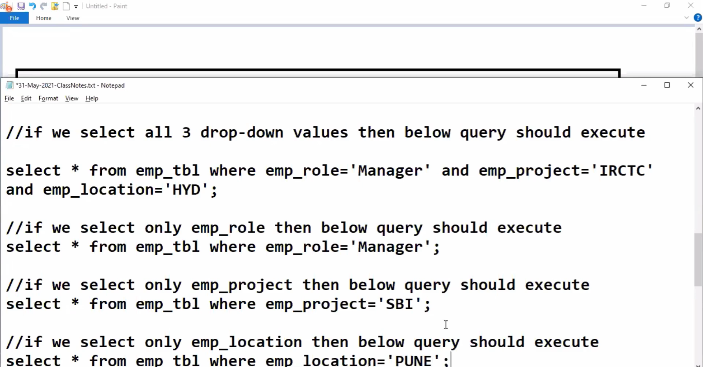
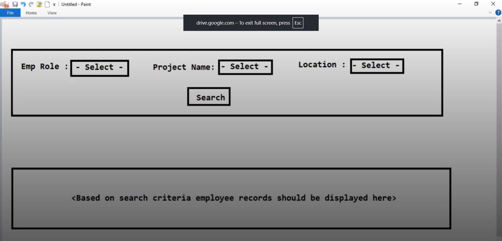

# Dynaic Query Creation Using Example

# I want to query based on selection of Emp role as manager and project name
# from  dropdown as IRCTC and Location as Hyderabad.

# IF we select all three drop-downs
# 1. Retrieve all Managers working for IRCTC project in Hyd Location.

# 1. Select * from emp_tbl where emp_role = 'Manager' and 
 # emp_location = "HYD" and emp_project = "IRCTC"

# 2  if we select only employee role

 # select * from emp_tbl where emp_role = manager"

# 3 if we select only emp_project 

# select * from emp_tbl where emp_project = 'SBI'

# 4 if we select all employes whose location is PUNE
# select * from emp_tbl where emp_loc = "PUNE"