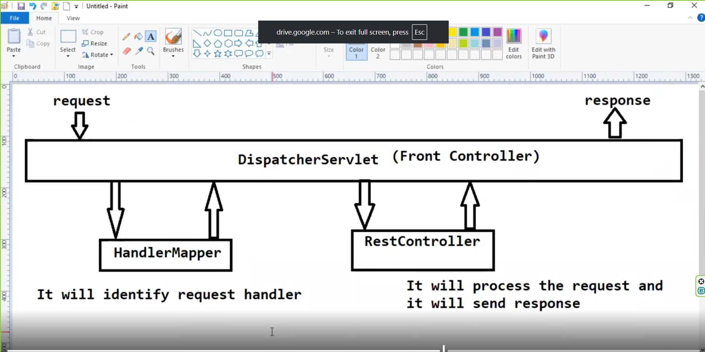
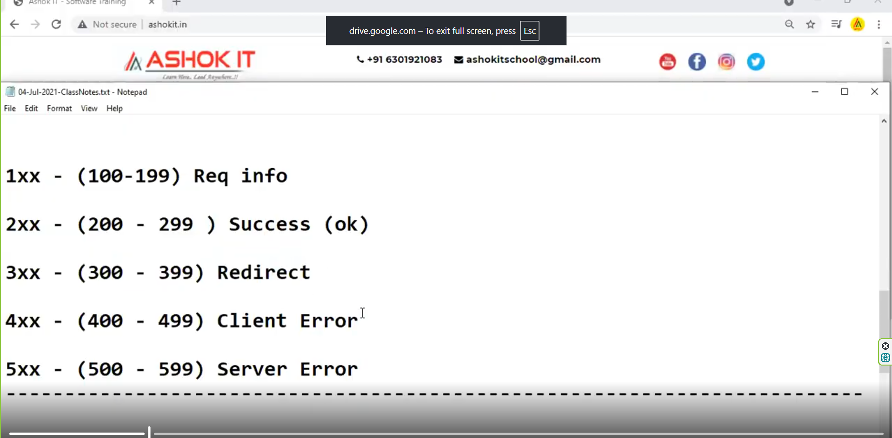
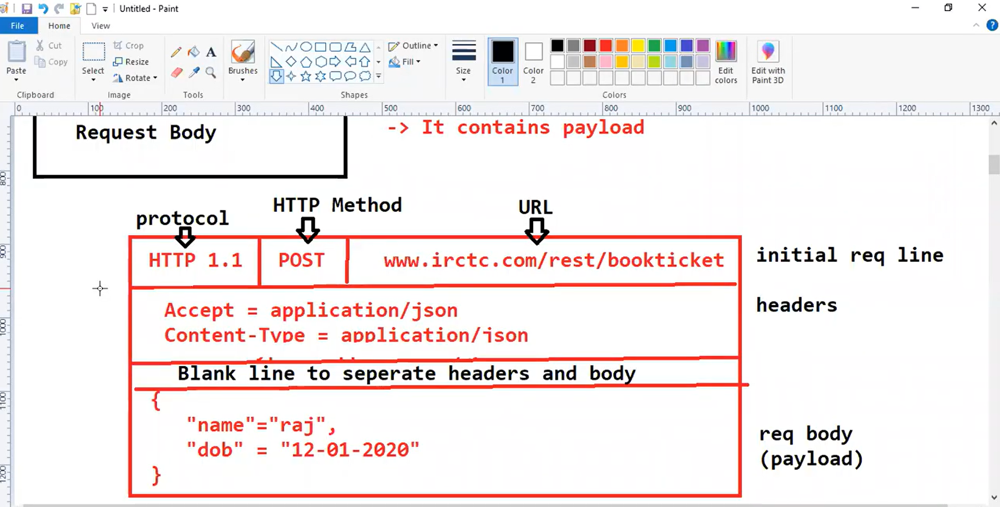
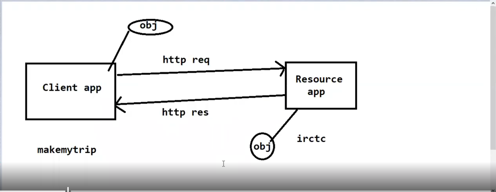
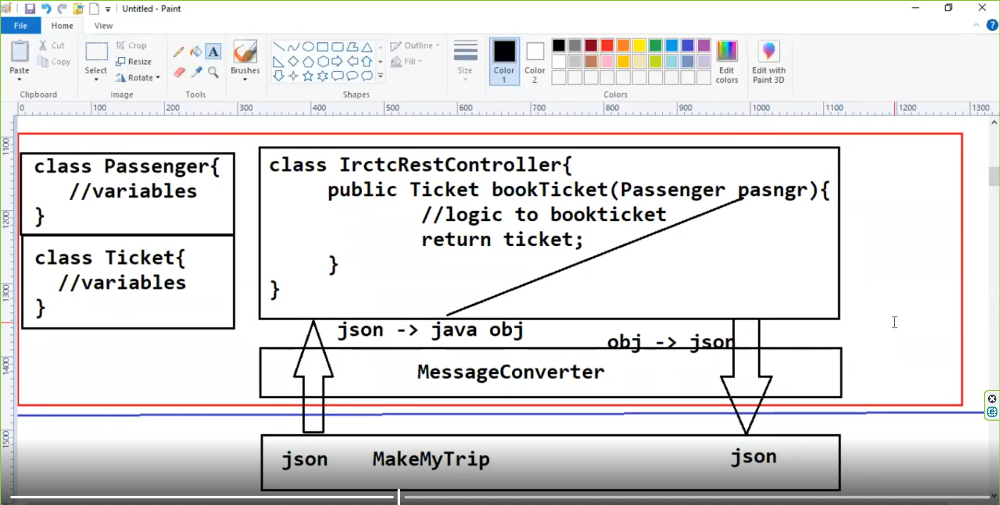

# Whenever we are representing our class as @RestController , it means it is a distributed
# component so that one application can communicate with another application.whenever we represent
# our class as restcontroller annotation other application can access the services from our application, we are developing a provider application instead of consumer application

# @Controller :- C2B communication(IRCTC, make )
# @RestController:- B2B communication(IRCTC, makemytrip), in case of makeMyTrip you can booked hotel,flights,restaurant, they don't build application for hotel,flight , they call
# service of flight,hotel etc so they are B2B.

# WelcomeController is a distributed component which handle request which comes from other service. it have the distributed method to perform distributed
# operations. we design rest api. Whenever Request comes from other service it goes Dispatcher Servlet , dispatcher servlet perform pre/post-processing and give the request to handlerMapper, handler will identify this request will be handle by which controller/restcontroller,

# a application can have controller/restcontroller , controller/restcontroller known as request handler , after identifying handlemapper will give controller data(controller name) to dispatcher servlet . dispatcher servlet now call the method of that controller class/component,
controller method processing the request and give response to dispatcherservlet, dispatcherservlet give data as response.

# here we have two method which is binding to same httpRequest(i.e GetMapping) in that case url pattern is mandatory, if we have only
# one method then url pattern is optional.
@RestController
public class WelcomeController {

    @GetMapping()
    public String greet(){
        return "Welcome to first Rest Api Project";
    }

    @GetMapping()
    public String wish(){
        return "Good morning!!";
    }
}

# Caused by: java.lang.IllegalStateException: Ambiguous mapping. Cannot map 'welcomeController' method
  com.spring.restapi.implementation.controller.WelcomeController#greet()
   to {GET [/ || ]}: There is already 'welcomeController' bean method
  com.spring.restapi.implementation.controller.WelcomeController#wish() mapped.
  
# 1. unique url or url pattern must be different  on class level/method level to avoid ambiguity
# We have to maintain unique level url pattern at class and method level i.e if i created a class as Report Controller 
# then it must having url pattern at class level must be @RequestMapping("/report), or if i have userController then it have url pattern must be @RequestMapping("/user") at class level

# 2. we have to use limited method or same method to bind our method.
# Every method must bind with http protocol/ http request method only, like @getMapping, @postmapping et.

# what are rules for url mapping & Http Method(Http protocol method you have to know if you are working with rest  or microservice )

# if when application want to communicate another application  in that case http protocol  is required, http protocol having http request and http response. client send ,Http Request to server and server sends http response to client. How request will process/status of the request  by server known by http codes.
# 1. In Rest Api every method should be binded to unique address.To achieve this we are writing Url pattern at 
   #  class level or method level also.
# 2.  Every REST API method should be binded to http protocol method.Clients can easily access our REST api method using http protocol.

#  ResponseEntity class we are using to construct response to client, using ResponseEntity class we can set "response body" and "http status code" for response.

# ResponseEntity why we use , to send customize the response http status code to a request by programmer instead of default httpstatus code(it is decided by server itself)
 # we can construct response body along status code by using ResponseEntity. if we don't use responseEntity server will decide the status code otherwise if you want to customize
# the status code of request/response then use ResponseEntity.

# Http Request Structure

# This information is inside header 
# Accept:- application/json (Client send data into request as json type)
# content-Type:- application/json (client expect  response as json type) this is known as metadata(data about data)

# 3 Client app & Resource app can exchange the data as per their requirement. restful service can support multiple format of data(like json,xml etc)
# During the transfer data as request/response must follow interoportability
# Interoperability means different application can work together and exchange information, even if they’re use different technologies. like client app (makemytrip) send http request to with data as passenger name addharcard etc to book ticket
# by irctc and send this data to ircts application, irctc application process the request and send data to makemytrip as data like details of ticket book information,
# 
# they can't send data into object format because makemytrip application in different technolgoy (like c#) while irctc application in (java) so they don't transfer data into object , they can transfer data into json/xml.so we use message convertor (internally springboot do) which convert json to object and object to json.
# 

# In the above image why we take object as parameter not json/xml reason is that if i take json type as parameter in that case
# we can't take xml parameter so to take data as  json/xml we use object type parameter in method.Client not deal with objects, Client send data into json and expect 
# data into json. but Resource expect data into object and send data into object .
 # so conversion is required :- json -> object , object ->json so inbuilt-message conversion are their.we have to tell in http request header( from client side by header metadata )
# what type data they send/expect but in case of response header by content-type we tell in which format data response send.
# makeMyTrip application by HTTP REQUEST HEADER tell us that what type data they are expecting and send by using header metadata contentType and Accept.
# At Resource end(server end) we have message convertor i.e Dispatcher Servlet as well as on Client end they have their own message convertor.

# @XmlRootElement
# how rest api knows client expect in which format data(xml/json) ,Accept in http header tells in which format client expect the data from rest api.interoperability is here one client accept xml data while other client expect json .
# method binding , convert obj to json/xml respectively.

# Message Converters:- 
# We are using objects for rest api methods development.
# method parameter and method return type we are using as objects.If we use objects then our methods will be loosely coupled with format.
@RestController
public class BookRestController {

    @GetMapping("/book")
    public Book getBookData(){
       return  new Book(101,"The Complete Refernce",255.50);

    }
}

#  Quest:-  As the above rest api method is returning object,client will receive that object or not ?
# Ans) Client will not receive that object due to interoperability. Rest api side  Message converters will be available to convert the object data into client 
# understandable format.
