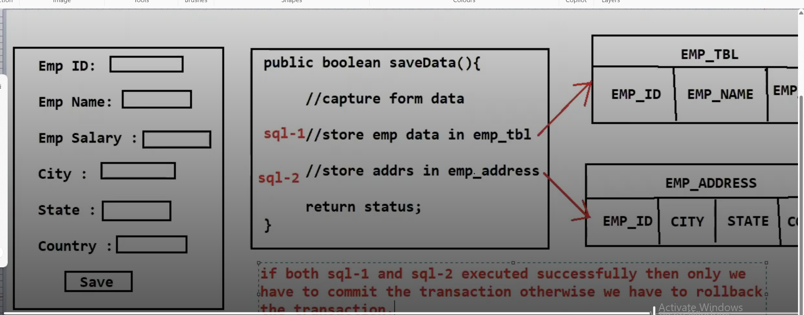

# This project domenstarte transaction Rollback

# If i don't use @Transaction(rollback for = Exception.class) in that case 
# whenever it get save() command it commit the transaction by default
# transaction is autocommit () means when get save() command just persist
# without looking whole code or is their any exception or not
# so in our case first we save employee record and after that we have
# exception statement then save employee address records in that case if employee adress is not saved no use
# of saving employee record so if their any exception i want rollback whatever early persist or save
# insert command not run untill their is sucesfully execution of methods

# -------------------- order of execution of sql query if i don't user @Transactional() it is autocommit() ------------
 # Hibernate
         select
        e1_0.emp_id,
        e1_0.emp_sal,
        e1_0.emp_name 
    from
        employee_tbl e1_0 
    where
        e1_0.emp_id=? 

# Hibernate
        insert 
    into
        employee_tbl
        (emp_sal, emp_name, emp_id) 
    values
        (?, ?, ?)

# Hibernate
       select
        a1_0.emp_id,
        a1_0.city,
        a1_0.country,
        a1_0.state 
    from
        emp_address a1_0 
    where
        a1_0.emp_id=?

# Hibernate
       insert 
    into
        emp_address
        (city, country, state, emp_id) 
    values
        (?, ?, ?, ?)       

# -----------------------------------End here without using  @transactional() annotation ----------------

# -----------------order of execution of sql query if i use @Transactional() ----------------------------
#  Hibernate:
    select
        e1_0.emp_id,
        e1_0.emp_sal,
        e1_0.emp_name 
    from
        employee_tbl e1_0 
    where
        e1_0.emp_id=?
# Hibernate:
 
    select
        a1_0.emp_id,
        a1_0.city,
        a1_0.country,
        a1_0.state 
    from
        emp_address a1_0 
    where
        a1_0.emp_id=?

# Hibernate 
    insert 
    into
        employee_tbl
        (emp_sal, emp_name, emp_id) 
    values
        (?, ?, ?)

#  Hibernate
     insert 
    into
        emp_address
        (city, country, state, emp_id) 
    values
        (?, ?, ?, ?)

# ----------------------------------- END Here if we use @Transactional() insert() query run after sucessfully method execution-------

# comment this line //        int c = 10/0; /* after commented or without commented */  then see execution order of
# sql query 