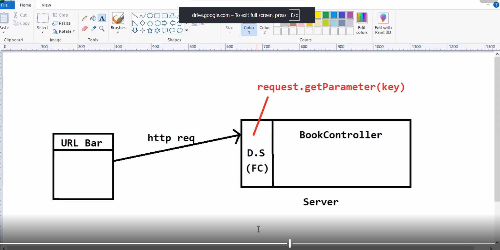
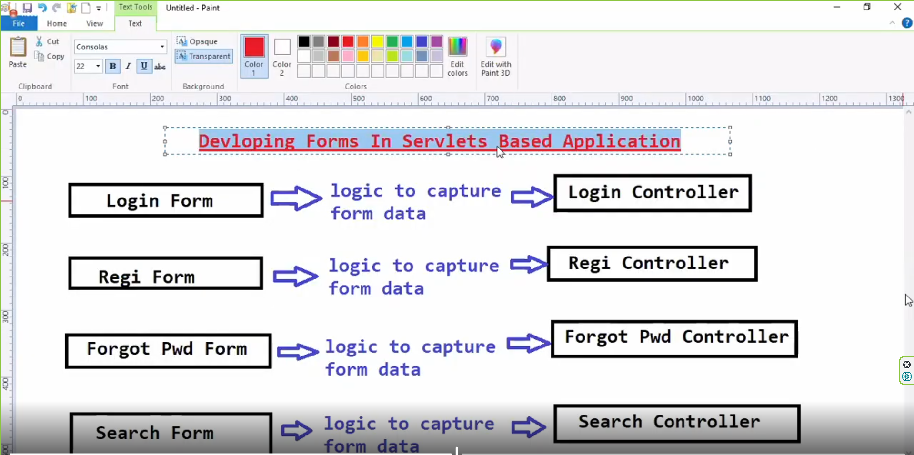
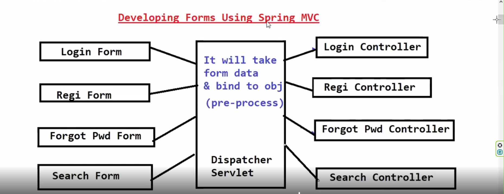
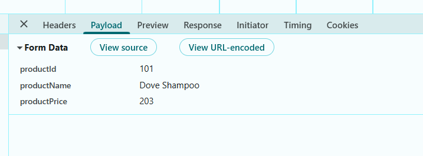

# TO send data from controller to UI we use model object

# @ResponseBody
# By default @controller annotation on  method return value will be considered as Logical View Name.
# In some situations, we have to return raw response form controller method directly(like for 
# Ajax calls).
# To return raw response from controller method we will use @ResponseBody

# ---------------------------Different way to take data from UI to controller --------------------------------------------------

# 1. ---------------------------QueryParameter----------------------------------------------------------------------------------------------

# @RequestParams:- To Read query parameter Data from url we use @RequestParams, Controller directly read query parameter data from url or dispatcher servlet will read and pass data
# to our controller its known an pre-processing execution as  part of request processing dispatcher servlet will take query parameter from url and pass as parameter to our controller method
# Whenever you send a request , then spring mvc will receive that request info then dispatcher servlet will read the data from request  and  will give data as parameter  to our method of the controller,
# this is known as per-processing. Generally whenever you send a request spring mvc receive that request info then dispatcher servlet read data from request request.getParamerter() and will give to our method as parameter know as pre-processing
# in order to get data from url dispatcher servlet will user request.getParameter() then it pass
# value to our method as parameter.
# what is  Preprocessing:- Reading data from request and giving to our method as input know as pre-processing  here .

# @ResponseBody :- To send raw data as response to UI/Client , we use responsebody annotation on method level otherwise dispatcher servlet understand
# it going to return logical viewName.

1. 
# when queryParameterName and method parameter name is same then @RequestParam annotation is optional, here isbn is same queryParameter name and string isbn same method parameter name 
# in method getBookPrice
#  http://localhost:9095/book?isbn=ISBN002   
    public String getBookPrice(String isbn){

        String msg =  "The book Price of" + isbn + " Is : 450.00 INR";
        return msg;
    }

# 2. Method Param Name and queryParam key Name are different 
#  method param name in this case is str and query param key name is isbn 
 # http://localhost:9095/book?isbn=ISBN001
   @RequestMapping("/book")
    @ResponseBody
       public String getBookPrice(@RequestParam("isbn") String str){
       String msg =  "The book Price of " + str + " Is : 450.00 INR";
        return msg;
      }

# how to pass multiple query parameter to a method
http://localhost:9095/course?cname=SBMS&trainer=ashok
   

# their is a limit to send data to query parameter is 1024 character

# whenever you write an annotation on class level it applicable to all method of class despite when you write annotation at method level it applicable only this method.
# queryParameter is mandatory to pass to url , if we don't supply query parameter we are not able to  called the method get WHILE LABEL ERROR.
# other way we can set defaultValue to queryParam to make it optional
#   public String getBookPrice(@RequestParam(name = "isbn", required = false, defaultValue = "ISBN002") String isbn) {
        String msg = "The book Price of " + isbn + " Is : 450.00 INR";
        return msg;
    }

# --------------2  PathParameter --------------------------------------------------------------------------------------------------------------

# @PathVariable annotation 
2. # PathParameter:- should be represented in url pattern
   # "/book/{isbn}/price" 
3. # To differentiate between path parameter and url pattern we use {} to represent path variable
4. # we can't use annotation @PathParams because it is used by socket class so spring vendor
5. # provide annotation @PathVariable
# If we are developing web application then we use QueryParameter then if we are developing
# rest api then we use path variables

# Drawback with HttpServletRequest 
# 1 HttpServletRequest req i.e req.getParameter("key") their is some problem with this approach if i have n no of parameter which
# i take from form i need to write n no of queries(req.getparameter("key")) for that.
# 2 because pid is number type but we are getting from form as string need to do typecast for all fields which that type
# so we have to use spring mvc form tag library.

# Pre-processing :- whatever the logic you write in all controller  will be handle by dispatcher servlet,
# who will be responsible to handle this common logic that is dispatcher Servlet  whenever we submit a form our controller no need to capture the form data, dispatcher servlet
# will capture data from form  and store in the object that is called as preprocessing of data , who is going to capture the form data, dispatcher servlet capture the form data
# and store object here spring mvc module told that hey spring developer if you are developing  a web application with forms then you can develop form using spring mvc tag library 
# easily i can bind formdata to object vs object to formdata, used by tag to develop form despite using plain html.tag library contain serveral tag you can develop form dynamically , you can populate
# dynamic data or easily bind formdata to object , you don't need to write to capture the formdata dispatcher servlet will do that.

# ---------------- Before Spring MVC what a developer to do or developing form  in  servlet based application  --------------------------------------------------
#  in this screenshot problem is that we write boiler code for every controller to capture data from form to controller i.e we need to write

#  servlet classes you have to develop and you write the logic to capture data from form to every controller it is recommended to write logic to every class controller to capture form data or it is
# no recomended(answer is no)

# -----------------------------------developing form using spring mvc ----------------------------------------------------------------------------------------------------
 # whenever you submit a form , the request will go to dispatcher servlet , it will take care of pre-processing, it will take form data and bind to object
# you no need to write the logic to capture the form data, no need to write the logic to bind form data to object because
# dispatcher servlet will going to do pre-processing of a request, what is pre-processing it is doing here
# it's going to take care of capture of form data and it will populating the form data to object and you submit the login form  the request will go to login controller , registration controller,
# forgetPasswordController so on.
#  in this approach programmer no need to write the logic to capture the form data , because dispatcher servlet it available as front controller , it responsible for pre-processing
# when you submit the form request , it goes to controller , not directly by ui to controller between in the ui and our controller dispatcher servlet will be available which act as front controller, the dispatcher servlet which act as front controller , dispatcher servlet it take form data,it will contain the logic to capture form data and store data to object  and give the object to your controller
# directly so you don't need to write request.getParameter("key") onwards to capture the data from form. whenever you submit the data ,dispatcher servlet will take data and convert data to object and give object as parameter to your controller.
# in order to develop form data simply  they develop tag library.in spring mvc based application we no need to capture to form data ,because dispatcher servlet will take care of that to simplified form development spring mvc provided form tag library.spring mvc form tag library contains serval tags

# ---------------------------------------------------------End Developing form using spring mvc---------------------------------------------------------------

# -------------- default.jsp  (description how default.jsp works) -----------------------------------------------
# how to bind formdata to an object i.e in default.jsp we use modelAttribute="product" to bind formdata to product object.
# whenever you press submit button which url pattern is invoke it mention by action attribute of  form.
# <form:form action="saveProduct" >
# modelAttribute:-  specifies the key of the class which holding the object.
# path:-to tell which field should  store to which variable of  class. or to bind object data to field.

# ------------------------------------default.jsp (description ends here)-------------------------------------------------------

#  ------------------------------------Project small concept explaining here --------------------------------------------------------------------------------
 # if we use primitive type instead of wrapper class on form we are able to see default value of fields like ,0,0.0 etc. like 
# int productId,(Instead of this Integer productId), default value is 0
# string productName(Instead of String productName), default value is ""

# action : tells when we submit form which url it has to access.
# modelAttribute= "product " key which is holding the object to bind this formdata.
# method = "POST/GET "when we use post :- data will be go in request body but when we use get method request data will go into url.
# method = "GET" http://localhost:9095/saveProductDetails?productId=101&productName=Dove+Shampoo&productPrice=201
# method = "POST" http://localhost:9095/saveProductDetails
 # 

# Did i write logic to capture formdata and store into Product object , answer is No , so this is done by dispatcher servlet
# which is known as pre-processing.
#  @PostMapping("/saveProductDetails")
    public String saveProductDetails(Product product ,Model model){
        System.out.println("Product details which enter to form " +  product);
        model.addAttribute("msg","Saved to catalog successfully");
        return "saved";

    }
# ------------------------------------------------------------------End here----------------------------------------
# beauty of servlet whenever we submit a form data will go in the form of string in the network, from the ui when you submit a form the data will go in the form of string, if you 
# see our class binding the class variables into  different data type like Number productId, string productName,Number productPrice the form data will be store to object by converting into respective data type that called flexibility 
# of form binding dispatcher servlet capture form data converting the respective data type and storing into object,called  pre-processing of a request. dispatcher servlet performing pre-processing , whenever we submit a formdata
# the formdata storing into object not only storing into the object it is typecasting data into corresponding data type to store into the object.
# product id is a text field which is binding to class variable productId i.e we are binding form fields to variables by using path variable
                       <td>Product ID:</td>
                            <td>
                                <form:input path="productId" type="text" />
                            </td>

# saveProductDetails() this method will called by programmer or  dispatcher servlet answer is dispatcher servlet, my method is expecting
# one object that is product object . it is passing empty object or product object  with data it is passing product object with data, how comes data store into object am i storing data object manually or dispatcher servlet is storing,can i say before going to executing to our controller , dispatcher servlet performing preprocessing of a request, my controller will have logic to store the data 
# into db  , but before processing request to our controller, dispatcher servlet is performing preprocessing a request what is pre-precessing here it capture form data convert into the corresponding data type and storing data into the product object.
# if we are not using spring mvc and we are using httpServletRequest or servlet based form in that case we have to manually write the logic of binding form data and conversion of string data type to corresponding data type as well