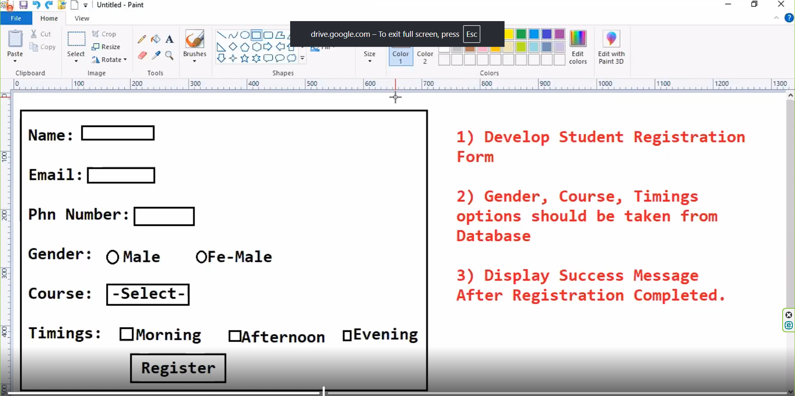
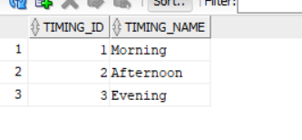
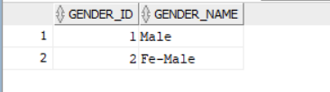
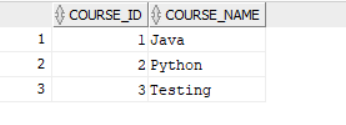

# INSERT INTO genders (gender_id, gender_name) VALUES (1, 'Male');
# INSERT INTO genders (gender_id, gender_name) VALUES (2, 'Fe-Male');
# INSERT INTO courses (course_id, course_name) VALUES (1, 'Java');
# INSERT INTO courses (course_id, course_name) VALUES (2, 'Python');
# INSERT INTO courses (course_id, course_name) VALUES (3, 'Testing');
# INSERT INTO timings (timing_id, timing_name) VALUES (1, 'Morning');
# INSERT INTO timings (timing_id, timing_name) VALUES (2, 'Afternoon');
# INSERT INTO timings (timing_id, timing_name) VALUES (3, 'Evening');

# ------------------Explaination-----------------------------------------
 # Am i writing to logic to capture the formdata or dispatcher servlet will write logic to write the formdata that is known as pre-processing of the logic
#  we are showing gender options,course options and timing option from database tables/entity
# genders,courses,timings table in db.
#   
# we are using three respositories to load data from the database
# create service class that is studentService , here we have logic to load data from database
# create form  binding class which is used to bind the  form data , form data can store to object and object data can store into the form.i.e Student class
# create student controller class i.e StudentController then create the presentation files , i.e index.jsp,saved.jsp

# How model object works ?
      @GetMapping("/loadForm")
    public String displayForm(Model model){
        model.addAttribute("genders",studentService.getGenders());
        model.addAttribute("courses",studentService.getCourses());
        model.addAttribute("timings",studentService.getTimings());
        Student student = new Student();
        model.addAttribute("student",student);

        return "index";
    }

# dispatcher servlet called this method , so in order to call this method dispatcher servlet will create the model and it will pass the model object as a parameter to this method, whatever data are you storing 
# dispatcher servlet will get data and will send to view component that means whatever you store in model object it will be available to that view file , mapping will be taken care by dispatcher servlet , model is just like a map which store data in key-value pair ,
# this map data available for index view file, whatever data you store in model object in the method , whatever view name return by method that model data available for view file. whenever you go view file
# it access modelAttribute="student", initially data will go from controller to view, in starting our student object don't have any data thats why form load which empty data i.e line 29 of above snipped code 

# dispatcher servlet fetch formdata, did we write the logic to capture data from form ans is no so dispatcher servlet will capture the formdata
# and store data into object pass  the form data as parameter i.e student object parameter  to method handleRegBtnClick() . that's reason we are able to access formdata by student object
    @PostMapping("/saveStudent")
    public String handleRegBtnClick(Student student, Model model){
        System.out.println(student);
        model.addAttribute("student", student);
        return "saved";

    }

# Detailed Code Flow Documentation (Read from CODE_FLOW_DOCUMENTATION.MD file inside this project)------------------------------------------------

# --------------------------when setTiming() method is called --------------------------------------------------------------------------------------
Form submits to /saveStudent (POST request) Spring MVC's DispatcherServlet processes the request Spring sees the controller method,
@PostMapping("/saveStudent")   
public String handleRegBtnClick(Student student, Model model)
Spring automatically: Creates a new Student object, Reads form parameters: name, email, phno, gender, course, timings For timings, it sees multiple values (checkboxes) and creates a String[]Calls student.setTimings(String[] array) to bind the data
Call stack:
DispatcherServlet.doDispatch()  → RequestMappingHandlerAdapter.invokeHandlerMethod()    → ServletModelAttributeMethodProcessor.resolveArgument()      → DataBinder.bind()        → BeanWrapperImpl.setPropertyValue()          → Student.setTimings(String[])  ← HERE!
When getTimings() is called.

# -----------------------------------------End here setTiming() method is called-------------------------------------------------------

# ---------------------------------when getTimings() method is called------------------------------------------------------------------------------
When:
Controller returns "saved" view (line 34 in StudentController),Spring renders saved.jsp
JSP encounters this code (line 91-92 in saved.jsp): <c:forEach var="timing" items="${student.timings}">,JSP EL evaluates ${student.timings}
This triggers: student.getTimings() to get the value.
Call stack:
DispatcherServlet.render()  → InternalResourceView.renderMergedOutputModel()    → JspServlet.service()      → index_jsp._jspService()        → JSP EL evaluates ${student.timings}          → Student.getTimings()  ← HERE!

# ------------------------------------End when getTimings() method called here ----------------------------------------------------------------------