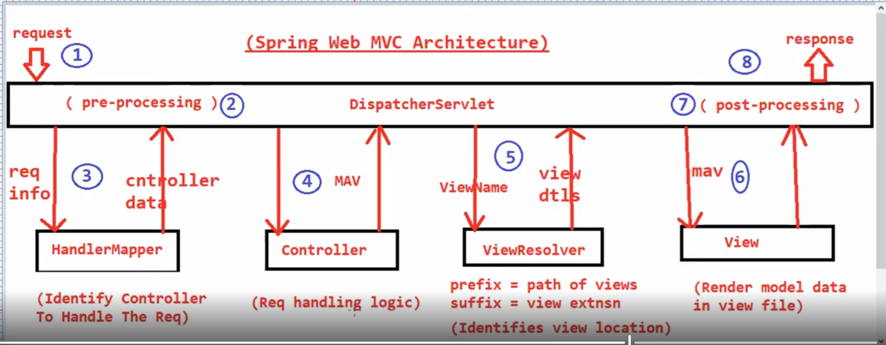

# When a spring mvc web application started how tomcat server and other component loaded(like view file and its content everything) you can see by log

2025-10-07T08:44:14.124+05:30  INFO 8644 --- [web.spring.mvc.project] [  restartedMain] o.s.b.w.embedded.tomcat.TomcatWebServer  : Tomcat initialized with port 9090 (http)
2025-10-07T08:44:14.150+05:30  INFO 8644 --- [web.spring.mvc.project] [  restartedMain] o.apache.catalina.core.StandardService   : Starting service [Tomcat]
2025-10-07T08:44:14.150+05:30  INFO 8644 --- [web.spring.mvc.project] [  restartedMain] o.apache.catalina.core.StandardEngine    : Starting Servlet engine: [Apache Tomcat/10.1.46]
2025-10-07T08:44:14.534+05:30  INFO 8644 --- [web.spring.mvc.project] [  restartedMain] org.apache.jasper.servlet.TldScanner     : At least one JAR was scanned for TLDs yet contained no TLDs. Enable debug logging for this logger for a complete list of JARs that were scanned but no TLDs were found in them. Skipping unneeded JARs during scanning can improve startup time and JSP compilation time.

2025-10-07T08:44:14.547+05:30  INFO 8644 --- [web.spring.mvc.project] [  restartedMain] o.a.c.c.C.[Tomcat].[localhost].[/]       : Initializing Spring embedded WebApplicationContext 
# Intializing the IOC Container
2025-10-07T08:44:14.548+05:30  INFO 8644 --- [web.spring.mvc.project] [  restartedMain] w.s.c.ServletWebServerApplicationContext : Root WebApplicationContext: initialization completed in 1894 ms
2025-10-07T08:44:14.698+05:30  INFO 8644 --- [web.spring.mvc.project] [  restartedMain] o.s.b.a.w.s.WelcomePageHandlerMapping    : Adding welcome page template: index
2025-10-07T08:44:15.046+05:30  INFO 8644 --- [web.spring.mvc.project] [  restartedMain] o.s.b.d.a.OptionalLiveReloadServer       : LiveReload server is running on port 35729
2025-10-07T08:44:15.119+05:30  INFO 8644 --- [web.spring.mvc.project] [  restartedMain] o.s.b.w.embedded.tomcat.TomcatWebServer  : Tomcat started on port 9090 (http) with context path '/'
2025-10-07T08:44:15.136+05:30  INFO 8644 --- [web.spring.mvc.project] [  restartedMain] c.s.web.spring.mvc.project.Application   : Started Application in 3.375 seconds (process running for 4.106)
#  Dispatcher Servlet acting as frontend Controller these lines prints only in logs when we hit
# url http://localhost:9090/welcome and do we need to configure dispatcher servelet or spring boot will do this
 # Dispatcher Servlet  is inbuilt configuration in spring boot
2025-10-07T08:45:13.425+05:30  INFO 8644 --- [web.spring.mvc.project] [nio-9090-exec-2] o.a.c.c.C.[Tomcat].[localhost].[/]       : Initializing Spring DispatcherServlet 'dispatcherServlet'
2025-10-07T08:45:13.425+05:30  INFO 8644 --- [web.spring.mvc.project] [nio-9090-exec-2] o.s.web.servlet.DispatcherServlet        : Initializing Servlet 'dispatcherServlet'

#       ----------------------- Details Summary of this project how spring mvc web module works or Architecture-----------------------

# first request comes to dispatcher servlet which act as frontend controller it will pre-processing request 
# and gives request to handlerMapper now handlerMapper base on URL configuration identify which controller handle the
# request and which method of controller handle request so here url is /welcome and based on this url configuration it identifies named WelcomeController controller handle the request
# and method displayWelcomeMsg() of this controller and give that information to dispatcherServlet and dispatcherServlet call that controller
# class method and executes some logic  now dispatcher servlet get modelAndView object[ ModelAndView mav = new ModelAndView();
 #        mav.addObject("msg","Welcome to first spring mvc project");
  #       mav.setViewName("index");] which contain name of view i.e in our case viewName is
# index and model object in key-value pair. and now Dispatcher Servlet gives the viewName(index) to view Resolver and View Resolver already
# know suffix and prefix (using these properties spring.mvc.view.prefix=/views/  & spring.mvc.view.suffix=.jsp) now it(ViewResolver) calculate formula
#  Formula:- 
#     Prefix + ViewName + Suffix
#     views(folder) + index(filename) + jsp(extension of file)
# based on this formula it(ViewResolver) identifies where is view file is it means viewFile is in view Folder and it is a jsp file
# and viewResolver return this information to dispatcherServlet and now dispatcherServlet will give model data And View Data to View Component.
# View Component render the model data into view File and give that information to the DispatcherServlet and DispatcherServlet will do post-processing
# and return finalResponse to end User

# same url pattern can not used by multiple method of different controller so url pattern must be unique

# two way to write method in a controller
# 1 using ModelAndView object 
    # ModelAndView mav = new ModelAndView();
        # mav.addObject("msg","Implement how Spring mvc Works!!");
        # mav.setViewName("index");
        # return mav;
#  2. take Model as parameter and return view name 
    public String homePage(Model model){
        model.addAttribute("msg","Welcome to dashboard/Home Page");
        return "index";

    }
